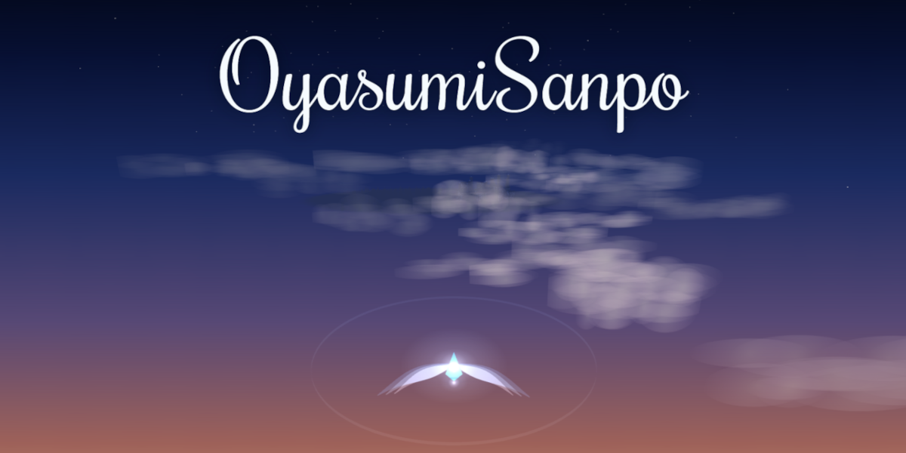

# OyasumiSanpo

A quiet 3D flying game — drift from a dim dusk into the starry sky, slipping through rings of light.

▶ **Play: https://oyasumi-sanpo.vercel.app/**



## Tech Stack

- **[Three.js](https://threejs.org/)** (r165) — 3D rendering, imported directly as an ES module from a CDN
- **Vanilla JavaScript** (ES modules) — no framework, no bundler, no build step
- **[Supabase](https://supabase.com/)** — online score ranking and developer auth
- **Web Audio API** — all BGM and sound effects are synthesized at runtime (no audio files)
- **Vercel** — hosting and analytics
- Fonts served via **Google Fonts**

## Running Locally

There is no build step, but the game uses ES modules and relative imports, so it has to be served over HTTP — opening `index.html` directly as a `file://` URL will not work.

```bash
# from the project root, start any static server, e.g.
npx serve .
# or
python -m http.server 8000
```

Then open the URL it prints in a browser.

Online ranking talks to a hosted Supabase project. The Supabase URL and **anon** key in `supabase.js` are public by design (browser-facing keys guarded by Row Level Security), so the game runs locally as-is.

## Project Structure

| File | Role |
|------|------|
| `index.html` | Markup, meta tags, HUD and overlays |
| `style.css` | All styling |
| `main.js` | The game itself — scene, rings, ship, physics, loop, HUD |
| `tuning.js` | Tunable constants in one place (speeds, spawn rates, colors, sizes…). Start here to change how the game feels |
| `audio.js` | Procedural BGM and sound effects (Web Audio) |
| `supabase.js` | Ranking and developer-auth client |

## About

This is my first attempt at building a 3D game, published as a learning log. The code and comments are rough in places, but it is shared in the spirit of learning in the open.

## License & Credits

All rights reserved. You are welcome to play the game and read the source, but the code is not licensed for reuse, modification, or redistribution.

Third-party components keep their own licenses:

- [Three.js](https://github.com/mrdoob/three.js) — MIT
- [supabase-js](https://github.com/supabase/supabase-js) — MIT
- Fonts served via Google Fonts:
  - Doto, Press Start 2P, Noto Sans, Noto Serif JP — SIL Open Font License
  - Rochester — Apache License 2.0
- All audio is synthesized in code via the Web Audio API (no third-party audio assets)
